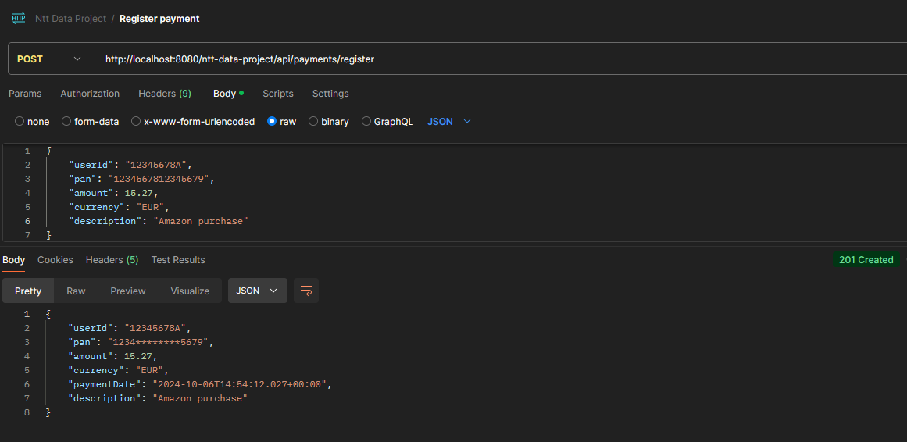
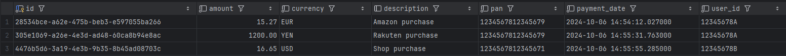

<!-- ABOUT THE PROJECT -->
## About The Project

Develop a credit card payment management microservice using Spring Boot, following the principles of hexagonal architecture, domain-driven design (DDD), and applying an API-First approach. The microservice should allow users to register new payments and view a list of existing payments.
<p align="right">(<a href="#readme-top">back to top</a>)</p>

<!-- GETTING STARTED -->
## Getting Started

### Prerequisites

Before you begin, you must have this software installed on your system:
* Git
  ```sh
  https://git-scm.com/
  ```
* Docker
  ```sh
  https://www.docker.com/
  ```
* Postman
  ```sh
  https://www.postman.com/
  ```

### Installation

_Below are the steps on how to run the service using Docker._

1. Clone the repo
   ```sh
   git clone https://github.com/csantosdeveloper/ntt-data-project.git
   ```
2. Open a terminal and go to the root folder of the repo, then use this command
   ```sh
   docker-compose up
   ```
    This command will do two things:
   1. Download the latest image of postgresql and run it, creating the database that will be used by the service.
   2. Create an image of the service and run it, connecting to the database previously created.
   3. Note: There is no need to run any script on the database to create the table, it will be automatically created when running the service based on the JPA entity due to this property in application.yaml:
   ```sh
   jpa:
     hibernate:
       ddl-auto: update
   ```
   
<p align="right">(<a href="#readme-top">back to top</a>)</p>

<!-- USAGE -->
## Usage

First, you can open this URL to view the Swagger API of the service.
  ```sh
   http://localhost:8080/ntt-data-project/swagger-ui/index.html#/
   ```
Then, you can use the two endpoints listed there on postman, one for register payments and one for list each payment of a single user.

<p align="right">(<a href="#readme-top">back to top</a>)</p>

<!-- VALIDATIONS -->
## VALIDATIONS
_Request validations list._
* userId: Must have a spanish DNI format (8 digits and one letter). Ex: 12345678A
* pan: Must have 16 digits. Ex: 1234567812345678
* amount: Must be a number. Ex: 150 or 150.25
* currency: Must have 3 letters: Ex: EUR, USD, YEN

<!-- DEMO EXAMPLES -->
## DEMO

### Register a payment




### List payments
After creating some payments (two of them for user 12345678A)




<p align="right">(<a href="#readme-top">back to top</a>)</p>

<!-- TEST -->
## TEST COVERAGE
### Test coverage excluding dto and model folders.
